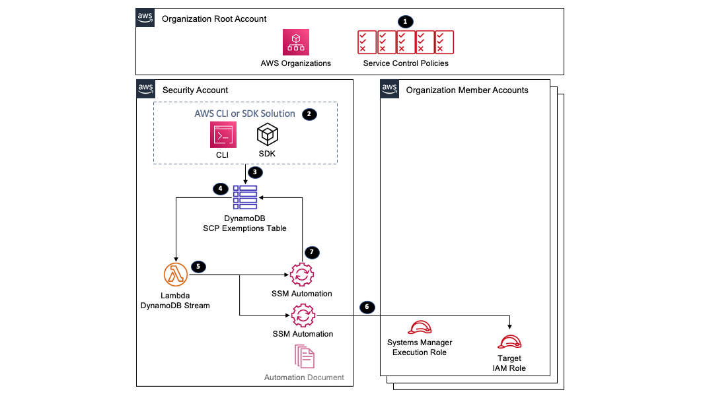
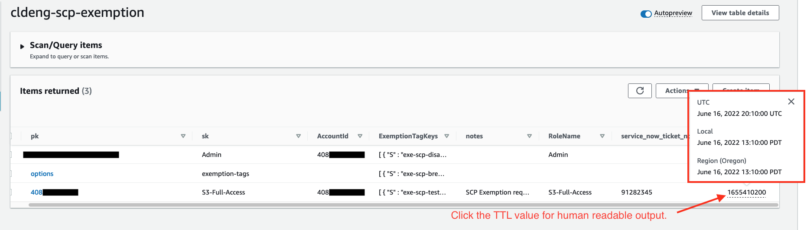

This library is licensed under the MIT-0 License. See the LICENSE file.

# SCP Exemptions Solution - How to securely provide Just-in-Time privileged access using ABAC and SCPs in multi-account environments?

Customers use [Service Control Policies](https://docs.aws.amazon.com/organizations/latest/userguide/orgs_manage_policies_scps.html) (SCPs) to prevent the use of privileged AWS service actions or to protect resources within AWS Organizations member accounts. They quickly realize that exemptions to the SCP policies for roles assumed by administrators or security automation solutions are required in order to configure the protected resources. The exemptions are usually provided permanently but are usually only needed temporarily during a security event or during a change window. 

This an elegant solution for managing SCP exemptions using [IAM principal tags](https://docs.aws.amazon.com/IAM/latest/UserGuide/access_iam-tags.html) while reducing the overall file size of the SCPs, which have a file size limit of 5120 bytes. By using IAM principal tags, access to restricted actions can be permanently or temporarily provided and done without modifying the SCP policies, which could have impacts on many accounts.

# What is an SCP?

[Service Control Policies](https://docs.aws.amazon.com/organizations/latest/userguide/orgs_manage_policies_scps.html) (SCPs) offer central control over maximum available permissions for all accounts in the AWS organization. SCPs alone are not sufficient for allowing access in the accounts in your organization. No permissions are granted by an SCP. Attaching an SCP to an AWS Organizations entity (root, organizational unit (OU), or account) defines a guardrail, or sets limits, on the actions that the IAM users and roles in the affected accounts can perform. You still need to attach [identity-based or resource-based policies](https://docs.aws.amazon.com/IAM/latest/UserGuide/access_policies_identity-vs-resource.html) to IAM users or roles, or to the resources in your organization's accounts to actually grant permissions. When an IAM user or role belongs to an account that is a member of an organization, the SCPs can limit the user's or role's [effective permissions](https://docs.aws.amazon.com/organizations/latest/userguide/orgs_manage_policies_scps.html#scp-effects-on-permissions).

# SCP Exemption Solution Benefits

* Provides the ability to give temporary access to privileged actions by tagging or untagging the role
* Eliminates permanent privileged access
* Reduces SCP modifications (e.g. Detach SCP or ad hoc updates)
* Reduces the overall SCP file size due to requiring fewer characters for exempting multiple roles
    * Review Quotas for [AWS Organizations](https://docs.aws.amazon.com/organizations/latest/userguide/orgs_reference_limits.html#min-max-values)

# SCP statement comparison:

## Using permanent exemptions
```json
1  {
2    "Sid": "GuardInfrastructureS3Buckets",
3    "Effect": "Deny",
4    "Action": [
5      "s3:*"
6    ],
7    "Resource": [
8      "arn:aws:s3:::sensitivebucket*"
9    ],
10   "Condition": {
11     "ArnNotLike": {
12       "aws:PrincipalARN": [
13         "arn:aws:iam::*:role/AWSControlTowerExecution",
14         "arn:aws:iam::*:role/AdminRole1",
15         "arn:aws:iam::*:role/AdminRole2",
16         "arn:aws:iam::*:role/AdminRole3",
17         "arn:aws:iam::*:role/SecurityRole1",
18         "arn:aws:iam::*:role/SecurityRole2",
19         "arn:aws:iam::*:role/SecurityRole3",
20       ]
21     }
22   }
23 }
```
  
## Using principal tags for exemptions
```json
1  {
2    "Sid": "GuardInfrastructureS3Buckets",
3    "Effect": "Deny",
4    "Action": [
5      "s3:*"
6    ],
7    "Resource": [
8      "arn:aws:s3:::sensitivebucket*"
9    ],
10   "Condition": {
11     "Null": {
12       "aws:PrincipalTag/exc-scp-platform-bucket-restriction": true,
13       "aws:PrincipalTag/exc-scp-break-glass": true
14     }
15   }
16 }
```

# What is an SCP exemption?

SCP statements are used as a way to deny access to highly privileged AWS service actions within AWS Organization member 
accounts. Exemptions to these SCP statements are required by administrators and automated processes that need to 
perform the denied actions within the member accounts. 

Permanent exemptions within SCPs should be limited and even eliminated when possible to reduce the risk of accidental 
or malicious activities within the environment. 

### Here are some example use cases where customers require SCP exemptions:

* “Break-Glass” - Providing unrestricted access to allow for debugging or security investigation
* Temporary access to create or modify a restricted resource
* Temporary access to test out a new solution
* Perform tasks that require the root user - 
  [Tasks that require root user credentials](https://docs.aws.amazon.com/general/latest/gr/root-vs-iam.html#aws_tasks-that-require-root)

### Here are some customer approaches for allowing SCP exemptions:

* Permanently exempt roles within the SCP statement condition
* Detach the SCP from the OU where the action needs to be performed
* Modify the SCP allowing the user or role to perform the action
* Detach an SCP without exemptions and attach a new SCP that includes exemptions
* Temporarily move an account to an OU that allows the actions to be performed


## SCP exemption approach using IAM principal tags

[IAM principal tags](https://docs.aws.amazon.com/IAM/latest/UserGuide/access_iam-tags.html) are resource tags attached 
to an IAM role and are passed during an AWS API request. SCP statements can have conditions that check to see if the 
requesting role has a specific tag attached to it providing an exemption to the SCP statement.

### Core concepts

* Restrict tagging IAM roles with a specific tag key prefix (e.g. “exe-”) to an administration role
* Leverage IAM principal tag conditions within SCP statements
* Tag and untag roles using a Systems Manager automation document
* Keep track of SCP exemptions in a DynamoDB table

### SCP statements

* Example SCP statement that only allows roles that are tagged with exe-scp-platform-bucket-restriction or 
  exe-scp-break-glass to perform the S3 actions on buckets starting with "sensitivebucket"
    ```json
    1  {
    2    "Sid": "GuardInfrastructureS3Buckets",
    3    "Effect": "Deny",
    4    "Action": [
    5      "s3:*"
    6   ],
    7     "Resource": [
    8      "arn:aws:s3:::sensitivebucket*"
    9    ],
    10   "Condition": {
    11     "Null": {
    12       "aws:PrincipalTag/exe-scp-platform-bucket-restriction": true,
    13       "aws:PrincipalTag/exe-scp-break-glass": true 
    14     }
    15   }
    16 }
    ```

* Required SCP statement that only allows the **scp-exemption-ssm-automation-execution** IAM role to perform the IAM 
  actions for tag keys starting with **“exe-”**. You can add additional IAM administrator roles to this list but this list 
  should be restricted to a small group with regular audits.


    ```json
    1  {
    2    "Sid": "GuardIAMExemptionTagging",
    3    "Effect": "Deny",
    4    "Action": [
    5      "iam:TagRole",
    6      "iam:UntagRole",
    7      "iam:TagUser",
    8      "iam:UntagUser"
    9    ],
    10   "Resource": "*",
    11   "Condition": {
    12     "ForAnyValue:StringLike": {
    13       "aws:TagKeys": ["exe-*"]
    14     },
    15     "ArnNotLike": {
    16       "aws:PrincipalARN": [
    17         "arn:aws:iam::*:role/scp-exemption-ssm-automation-execution"
    18       ]
    19     }
    20   }
    21 }
    ```


# Architecture Overview



### The architecture works as follows


#### In the AWS organization root account:

Service Control Policies (SCPs) are attached to the organization member accounts preventing the ability to perform specific actions unless an exemption tag is present


#### In the SCP Management Account (security account):

* Administrators can request temporary exemptions for an IAM role in their account via AWS CLI or an approved solution
that has the ability to perform DynamoDB API calls

    * Requests can be to add or remove an exemption tag from a role

* A record is created or deleted in the SCP exemptions DynamoDB table

* The creation or deletion of a record in the DynamoDB table triggers a Lambda function sending the event record

* The Lambda function invokes Systems Manager within the delegated admin account with a target of the member account

* The SCP exemption Systems Manager automation document is executed from the security account adding or removing the
exemption tag to/from the target IAM role

* If a Time to Live (TTL) value is provided, the cleanup Systems Manager automation document is executed from the
security account waiting until the TTL expires to delete the item from the DynamoDB table. Deletion of the item will
trigger step 5 and 6 to un-tag the role in the target account.

# High-Level Implementation Steps

## Pre-Requisites
1. Select account for deploying/managing the SCP Exemption solution (security account/OU recommended). 
2. Define a list of allowed exemption tags in [exemption-tag-keys-item.json](./dynamodb-items/exemption-tag-keys-item.json)
3. Tag your break glass or other critical roles that require permanent exemptions.
4. Refactor existing SCP statements to use SCP exemption tag condition. 
    * Example statements provided here: [example-member-scp.json](./policies/example-member-scp.json)
    * Determine which statements should have exemptions other than break-glass
    * Determine statement groupings (e.g. similar service actions)
5. Apply SCP to AWS Organization root to prevent users from adding/removing tags using exe-*.
    * The SCP policy is here: [scp-exemption-tag-statement.json](./policies/scp-exemption-tag-statement.json)
6. Add SCP to AWS Organization root to protect the SCP exemption resources 
    * The SCP policy is here: [scp-exemption-guardrails.json](./policies/scp-exemption-guardrails.json)
7. Terraform pre-requisites.
    
## Deploy Solution
1. Set the SSM Automation Region.
2. Package and upload the Lambda function to an S3 bucket.
    * [deploy-lambda.sh](./db-stream-lambda/deploy-lambda.sh)
3. Terraform Module Components
4. Deploy SCP Exemption Resources into the SCP exemption management account (security account/OU).
    * [main.tf](modules/scp-exemption-resources/main.tf) template
5. Deploy the Systems Manager (SSM) execution IAM role to all the AWS Organization accounts using the [ssm-execution-role.tf](modules/scp-exemption-role/ssm-execution-role.tf) template.
        * SSM Automation Execution Role
            * IAM get and list actions 
            * IAM tag and un-tag role and user 
            * IAM Pass Role for the SSM Automation Execution Role 
            * SSM Start Automation Execution on the SCP Exemption document prefix 
6. Optional - Add The List of Approved Tag Keys to DynamoDB
    * [exemption-tag-keys-item.json](./dynamodb-items/exemption-tag-keys-item.json)


## Functionality Testing
1. Grant an SCP Exemption
    * Examples of correct DynamoDB item JSON
    * Examples of incorrect DynamoDB item JSON
2. Remove and SCP Exemption

## Extended Testing
1. Attach SCP to Testing OU or Account
2. Test Without SCP Exemption Applied
3. Test With SCP Exemption Applied
4. Cleanup

# Implementation Guide

## Pre-Requisites

### Select account for deploying/managing the SCP Exemption solution

It's recommended that you use a security account and OU for deploying and managing this solution.

Write down the account id and regions for this deployment.

### Define List of SCP Exemption Tags

Review [exemption-tag-keys-item.json](./dynamodb-items/exemption-tag-keys-item.json) and update the tag keys to suit your needs.

The tags should all begin with exe-* unless you customize your SCP policy conditions and resources to use a different prefix.

For example:
    
```json
{
"ExemptionTagKeys": {
    "L": [
    {
        "S": "exe-scp-break-glass"
    },
    {
        "S": "exe-scp-platform-bucket-restriction"
    },
    {
        "S": "exe-scp-region-restriction"
    }
    ]
    }
}
```

### Tag your break glass or other critical roles that require permanent exemptions

Apply an **exe-YOUR_TAG_NAME_HERE** tag to the user/role requiring a permanent exemption. For example, use an **exe-scp-break-glass** or **exe-scp-permanent-exemption** tag.

Write down the tag name you choose, this will be used in the SCP conditions to exclude the role/user from the SCP.


### Refactor existing SCP statements to use SCP exemption tag condition

See [example-member-scp.json](./policies/example-member-scp.json) for some example SCPs.

1. Determine which statements should have exemptions other than break-glass.

2. Determine statement groupings (e.g. similar service actions)

3. Modify your SCPs Condition statements to include PrincipalTag for your break-glass role and/or tag for permanent exemptions (**exe-permanent-exemption** and **exe-scp-break-glass**) and include any other exemption tags you need.

    For example:

    ```json
    {
    "Version": "2012-10-17",
    "Statement": [
        {
        "Sid": "DenyDefaultEBSEncryption",
        "Effect": "Deny",
        "Action": "ec2:DisableEbsEncryptionByDefault",
        "Resource": "*",
        "Condition": {
            "Null": {
            "aws:PrincipalTag/exe-scp-disable-ebs-encryption": true,
            "aws:PrincipalTag/exe-scp-break-glass": true,
            "aws:PrincipalTag/exe-permanent-exemption": true
            }
        }
        }
    ]
    }

    ```

### Apply SCP to prevent users from using exe-* tags

Use the SCP policy below and apply it to your AWS Organizations root level to prevent any account or role from adding or removing SCP exemption tags (exe-*).

Update the SCP conditions statement to exclude any other necessary principals from this policy.

```json
{
    "Version": "2012-10-17",
    "Statement": [
        {
            "Sid": "DenyIAMExemptionTagging",
            "Effect": "Deny",
            "Action": [
                "iam:TagRole",
                "iam:UntagRole",
                "iam:TagUser",
                "iam:UntagUser"
            ],
            "Resource": "*",
            "Condition": {
                "ForAnyValue:StringLike": {
                    "aws:TagKeys": [
                        "exe-*"
                    ]
                },
                "ArnNotLike": {
                    "aws:PrincipalARN": [
                        "arn:aws:iam::*:role/scp-exemption-ssm-automation-execution"
                    ]
                }
            }
        }
    ]
}
```

### Apply SCP to Protect SCP Exemption Resources in the SCP Exemption Management Account (Security account)

1. See the [scp-exemption-guardrails.json](./policies/scp-exemption-guardrails.json) for a list of policies to protect your SCP exemption resources.

2. Review and update the policy condition statements to suit your environment.

3. Apply the SCP to your AWS Organizations root level.


### Terraform Pre-Requisites

The following prerequisites are required to deploy the solution:

1. [Download](https://www.terraform.io/downloads.html) and set up Terraform. Refer to the official Terraform [instructions](https://learn.hashicorp.com/collections/terraform/aws-get-started) to get started.

2. Make sure that your Terraform environment is able to assume an administrative role to implement the resources described in this documentation to your AWS Organizations member accounts and tag management account (security account/OU).

3. Install latest version of the [AWS CLI](https://docs.aws.amazon.com/cli/latest/userguide/install-cliv2.html) or use the [AWS CloudShell](https://docs.aws.amazon.com/cloudshell/latest/userguide/welcome.html). To use the AWS CLI, you must make sure that you have profiles to assume roles across your accounts. You can get more information about creating CLI configuration files in the [AWS CLI user guide](https://docs.aws.amazon.com/cli/latest/userguide/cli-configure-files.html).


## Deploy Solution

### Set the SSM Automation Region

The region from which the SSM automation is triggered is hard-coded in the python code [app.py](./db-stream-lambda/src/app.py)(line 145).

**You will need to manually update this to reflect the region you will be using for this solution.**

#### Manually update the region in [app.py](./db-stream-lambda/src/app.py)

For example, if you plan on deploying the SCP automation resources in a region other than us-east-1, you will need to update the region in [app.py](./db-stream-lambda/src/app.py)(line 145) as shown to reflect that. The default is set to **us-east-1**.


```py
def start_tag_automation_execution(document_dict):
    """
    Start an automation document with provided parameters
    :param document_dict: parameters required to execute the automation document
    :return: AutomationExecutionId
    """
    try:
        response = SSM_CLIENT.start_automation_execution(
            DocumentName=SCP_EXEMPTION_DOCUMENT_NAME,
            DocumentVersion="$DEFAULT",
            Parameters=document_dict["parameters"],
            Mode="Auto",
            TargetLocations=[
                {
                    "Accounts": [document_dict["account_id"]],
                    "Regions": [
                        "us-west-2",
                    ],
                    "TargetLocationMaxConcurrency": MAX_CONCURRENCY,
                    "TargetLocationMaxErrors": MAX_ERRORS,
                    "ExecutionRoleName": EXECUTION_ROLE_NAME,
                },
            ],
        )

```


#### Important Note - SSM Automation Failures (ssm:StartAutomationExecution)

If you don't make the necessary changes above you will receive the following [error](./code/ssm-documents/error.txt) in SSM when the automation runs.

```
User: arn:aws:sts::11111111:assumed-role/scp-exemption-ssm-automation-execution/a12361b1-9f75-4b61-84ef-d2078f31fdd9 is not authorized to perform: ssm:StartAutomationExecution on resource: arn:aws:ssm:us-east-1:11111111:automation-definition/scp-exemption-tag:1 because no identity-based policy allows the ssm:StartAutomationExecution action (Service: AWSSimpleSystemsManagement; Status Code: 400; Error Code: AccessDeniedException; Request ID: cf5b0f68-75f7-41d3-83af-6d3f4863fa37; Proxy: null)
```

### Package and upload the Lambda function to the S3 bucket

1. Create an S3 bucket for storing the necessary files.

    From the SCP management account (security account) selected earlier run the following:

    ```bash
    aws s3api create-bucket --bucket <your-bucket> --create-bucket-configuration LocationConstraint=<your-region>
    ```

2. Create the necessary temporary directories for storing the files

    ```bash
    mkdir ~/tmp/
    mkdir ~/tmp/sra-lambda-sr
    ```

3. Navigate to the directory with the necessary script [db-stream-lambda](./code/db-stream-lambda)
    
    ```bash
    cd <your-path-here>/scp-exemption-solution/code/db-stream-lambda
    ```

4. Run the command below to package the necessary files and upload to your S3 bucket.
    
    ```bash
    ./deploy-lambda.sh \
        --file_name scp-exemption-db-stream-lambda.zip \
        --bucket <your-bucket-name-here> \
        --src_dir <your-path-here>/scp-exemption-solution/code/db-stream-lambda/src

    ```

5. Check your S3 bucket to ensure the lambda package has been uploaded

    ```bash
    aws s3 ls <your-bucket-name-here>
    ```

### Terraform Module Components

* SCP Exemption Resources
    1.  [main.tf](modules/scp-exemption-resources/main.tf)
        * Creates a DynamoDB table for storing SCP exemption account,role, tag info, and any other custom fields added.
        * Creates an SSM Automation Admin role.
        * Creates an SSM automation tagging/untagging document
        * Creates an SSM automation tag cleanup document (removes expired tags).
        * Creates a lambda function that is triggered when new items are added to the DynamoDB table.
        * Creates an SCP lambda role used by the lambda function.
        * Creates a CloudWatch log group, which stores the lambda function logs.
        * Outputs the DynamoDB table stream arn and ssm automation role arn.

    2.  [variables.tf](modules/scp-exemption-resources/variables.tf)
        * Defines the input variables for this Terraform module.

* SCP Exemption Role

    1. [ssm-execution-role.tf](modules/scp-exemption-role/ssm-execution-role.tf)
        * Creates the SSM Execution role used by the SSM Automation document to tag roles in the AWS Organizations child accounts.
    
    2.  [variables.tf](modules/scp-exemption-resources/variables.tf)
        * Defines the input variables for this Terraform module.


### Deploy SCP Exemption Resources

Using [Terraform](https://www.terraform.io/), deploy the SCP exemption administration resources to the SCP exemption management account (security account/OU) using the [main.tf](modules/scp-exemption-resources/main.tf) module.

For documentation on using terraform to provision resources please refer to the [Official Terraform Getting Started Guide](https://learn.hashicorp.com/collections/terraform/aws-get-started).

The [main.tf](modules/scp-exemption-resources/main.tf) module will deploy the following resources:

1. DynamoDB Table**

- Billing Mode = Provisioned
- Point in time recovery enabled = True
- Time to live specification attribute = ttl


2. SSM Automation Admin Role**

- Assume SSM Automation Execution Role
- Organizations List Accounts
- DynamoDB Delete Item


3. SCP Exemption SSM Automation Document**

- Python script to tag or un-tag a role


4. Cleanup SSM Automation Document**

- Sleep for the wait time
- Delete item from DynamoDB table


5. Lambda Function with DynamoDB event trigger**

- Convert DynamoDB event to a Python dictionary
- Start the tag SSM automation
- Start the cleanup SSM automation

### Deploy the Systems Manager execution IAM role

Using [Terraform](https://www.terraform.io/), deploy the Systems Manager execution IAM role to all the AWS Organization accounts using the [scp-exemption-execution-role.tf](modules/scp-exemption-role/ssm-execution-role.tf) module.

You will need to deploy this role into all of the Organizations child accounts.

For documentation on using terraform to provision resources please refer to the [Official Terraform Getting Started Guide](https://learn.hashicorp.com/collections/terraform/aws-get-started).

The [scp-exemption-execution-role.tf](modules/scp-exemption-role/ssm-execution-role.tf) module will deploy the **scp-exemption-ssm-automation-execution** [aws_iam_role](https://registry.terraform.io/providers/hashicorp/aws/latest/docs/resources/iam_role) into the AWS Organizations account you specify.


### Optional - Add The List of Approved Tag Keys to DynamoDB

You can add the approved list of tag keys **example-tag-keys-item.json** to your DynamoDB table for referencing later: 

```bash
aws dynamodb put-item \
--table-name scp-exemption \
--item file://exemption-tag-keys-item.json
```

## Functionality Testing

### Granting an SCP Exemption

1. Update the JSON file [example-role-exemption-item.json](./dynamodb-items/example-role-exemption-item.json) with the primary key (pk), sorting key (sk), AccountId, RoleName, ExemptionTagKeys, and ttl.

    * **Important Note:** The pk must be the AccountId and the sk must be the RoleName. If you modify the pk and sk to something other than the AccountId or RoleName the cleanup script that removes the tags once the TTL expires will not work. However, they will still get deleted by the [DynamoDB TTL](https://docs.aws.amazon.com/amazondynamodb/latest/developerguide/howitworks-ttl.html) cleanup operations, which can take up to 48 hours from the items expiration. This means the SCP exemption can exist for an additional 48 hours despite the entry having an expired TTL. 

    * **TTL:** The ttl value must be provided in [Epoch Unix Timestamp](https://www.epochconverter.com/) format. This is the date/time when the exemption should expire. 
        * Example:
            * Epoch timestamp: **1655308800**
            * Timestamp in milliseconds: 1655308800000
            * Date and time (GMT): Wednesday, June 15, 2022 4:00:00 PM
            * Date and time (your time zone): Wednesday, June 15, 2022 9:00:00 AM GMT-07:00
        
        * **Ensure you enter a TTL value that is in the future, otherwise your DynamoDB item will be created and immediately deleted.**
        * Tip: Once your DynamoDB Item is created, you can click on the TTL for the DynamoDB item to view the human readable format.
            * 

    * **Permanent Exemption:** If you don't want the DynamoDB entry and SCP exemption to expire completely remove the TTL field from the JSON (see the example in the examples section).


2. Use the AWS CLI to add a DynamoDB item 

    By running the command below the role you specified in your JSON will be automatically tagged.

    ```bash
    aws dynamodb put-item \
        --table-name scp-exemption \
        --item file://scp-exemption-entry.json
    ```

    Contents of scp-exemption-entry.json
    ```json
    {
    "pk": {"S": "408111111111"},
    "sk": {"S": "Admin"},
    "AccountId": {"S": "408111111111"},
    "RoleName": {"S": "Admin"},
    "ExemptionTagKeys": {
        "L": [
        {"S": "exe-scp-disable-ebs-encryption"}
        ]
    },
    "ttl": {"N": "1655308800"}
    }
    ```

    Alternatively, you can paste the JSON directly into the command without referencing a file:

    ```bash
    aws dynamodb put-item \
        --table-name scp-exemption \
        --item '{
    "pk": {"S": "408111111111"},
    "sk": {"S": "Admin"},
    "AccountId": {"S": "408111111111"},
    "RoleName": {"S": "Admin"},
    "ExemptionTagKeys": {
        "L": [
        {"S": "exe-scp-disable-ebs-encryption"}
        ]
    },
    "ttl": {"N": "1655308800"}
    }'
    ```


#### Examples of Correctly Formatted DynamoDB Item JSON
1. **Temporary SCP exemption** adding the exe-scp-disable-ebs-encryption tag to the Admin role in account 408111111111.
    * See [example-role-exemption-1.json](./dynamodb-items/example-role-exemption-1.json)

    ```json
    {
    "pk": {"S": "408111111111"},
    "sk": {"S": "Admin"},
    "AccountId": {"S": "408111111111"},
    "RoleName": {"S": "Admin"},
    "ExemptionTagKeys": {
        "L": [
        {"S": "exe-scp-disable-ebs-encryption"}
        ]
    },
    "ttl": {"N": "1655308800"}
    }
    ```

2. **Permanent SCP exemption** adding the exe-scp-allow-s3-access tag to the S3FullAccessRole role in account 40822222222. 
    * See [example-role-exemption-2.json](./dynamodb-items/example-role-exemption-2.json). Note that TTL has been removed.
    ```json
    {
    "pk": {"S": "408222222222"},
    "sk": {"S": "S3FullAccessRole"},
    "AccountId": {"S": "408222222222"},
    "RoleName": {"S": "S3FullAccessRole"},
    "ExemptionTagKeys": {
        "L": [
        {"S": "exe-scp-allow-s3-access"}
        ]
    }
    }
    ```
3. **Customized** entry for an SCP exemption adding the exe-scp-test-4 tag to the S3-Full-Access role in account 40833333333. This is also adding two additional fields called "notes" and "service_now_ticket_no" to track the Service Now ticket for this request and any relevant notes that may be needed when auditing these exemptions.
    * See [example-role-exemption-3.json](./dynamodb-items/example-role-exemption-3.json)
    ```json
    {
    "pk": {"S": "40833333333"},
    "sk": {"S": "S3-Full-Access"},
    "AccountId": {"S": "40833333333"},
    "RoleName": {"S": "S3-Full-Access"},
    "ExemptionTagKeys": {
        "L": [
        {"S": "exe-scp-test-4"}
        ]
    },
    "ttl": {"N": "1655410200"},
    "notes": {"S": "SCP Exemption request ticket # 91282345. Reviewed and approved by Security Governance Officer John Doe"},
    "service_now_ticket_no": {"S": "91282345"}
    }
    ```

#### Examples of Incorrectly Formatted DynamoDB Item JSON

**DynamoDB won't prevent you from creating these incorrectly formatted items in the table, however, the SSM Automation will not be able to properly remove them once the TTL expires. You will need to wait for the DynamoDB based TTL cleanup to have them deleted or you can delete them manually.**

1. pk and sk has test appended to the account id and role id.
    ```json
    {
    "pk": {"S": "408111111111-test"},
    "sk": {"S": "Admin-test"},
    "AccountId": {"S": "408111111111"},
    "RoleName": {"S": "Admin"},
    "ExemptionTagKeys": {
        "L": [
        {"S": "exe-scp-disable-ebs-encryption"}
        ]
    },
    "ttl": {"N": "1655308800"}
    }
    ```

2. pk has test appended to the account id.  
    ```json
    {
    "pk": {"S": "408111111111-test"},
    "sk": {"S": "Admin"},
    "AccountId": {"S": "408111111111"},
    "RoleName": {"S": "Admin"},
    "ExemptionTagKeys": {
        "L": [
        {"S": "exe-scp-disable-ebs-encryption"}
        ]
    },
    "ttl": {"N": "1655308800"}
    }
    ```

3. sk has test appended to the role name.
    ```json
    {
    "pk": {"S": "408111111111"},
    "sk": {"S": "Admin-test"},
    "AccountId": {"S": "408111111111"},
    "RoleName": {"S": "Admin"},
    "ExemptionTagKeys": {
        "L": [
        {"S": "exe-scp-disable-ebs-encryption"}
        ]
    },
    "ttl": {"N": "1655308800"}
    }
    ```


### Removing an SCP Exemption

Delete the DynamoDB item you created to remove the tags from your role and remove the SCP exemption. 

See the [AWS CLI Documentation](https://docs.aws.amazon.com/cli/latest/reference/dynamodb/delete-item.html#examples) for deleting a dynamodb item.

```
aws dynamodb delete-item \
    --table-name scp-exemption \
    --key '{ 
    "pk": {"S": "408111111111"},
    "sk": {"S": "S3-Full-Access-Role"}
    }'
```


## Extended Testing

### Attach SCP to Testing OU or Account

From the Organization management account attach an SCP Policy to the Testing OU

```json
    {
    "Version": "2012-10-17",
    "Statement": [
        {
        "Sid": "DenyDefaultEBSEncryption",
        "Effect": "Deny",
        "Action": "ec2:DisableEbsEncryptionByDefault",
        "Resource": "*",
        "Condition": {
            "Null": {
            "aws:PrincipalTag/exe-scp-disable-ebs-encryption": true,
            "aws:PrincipalTag/exe-scp-break-glass": true,
            "aws:PrincipalTag/exe-permanent-exemption": true
            }
        }
        }
    ]
    }
```

### Test Without SCP Exemption Applied

1. From the testing account show role tags and ensure the user/role does NOT have the SCP exemption tags (see policy condition statement above) applied.

    ```bash
    aws iam get-role --role-name Admin
    aws iam get-user --user-name AdminUser

    ```

2. From the testing account enable EBS encryption by default

    ```bash
    aws ec2 enable-ebs-encryption-by-default
    ```

3. From the testing account attempt an action forbidden by SCP, you should get an access denied message

    ```bash
    aws ec2 disable-ebs-encryption-by-default
    ```

### Test With SCP Exemption Applied

1. Switch to the SCP management account (security account) and add an SCP exemption to the testing account/role in the testing OU covered by SCP

    Run the following command to add the item to your DynamoDB table
    ```bash
    aws dynamodb put-item \
        --table-name scp-exemption \
        --item file://scp-exemption-entry.json
    ```
    
    Contents of --item scp-exemption-entry.json
    ```json
    {
    "pk": {"S": "408111111111"},
    "sk": {"S": "EC2managementrole"},
    "AccountId": {"S": "408111111111"},
    "RoleName": {"S": "EC2managementrole"},
    "ExemptionTagKeys": {
        "L": [
        {"S": "exe-scp-disable-ebs-encryption"}
        ]
    },
    "ttl": {"N": "1655308800"}
    }
    ```

2. Switch to the testing account and verify the SCP exemption tag has been successfully added
    ```bash
    aws iam get-role --role-name Admin
    aws iam get-user --user-name AdminUser

    ```
3. From the testing account re-attempt action forbidden by SCP, the action should now complete successfully.

    ```bash
    aws ec2 disable-ebs-encryption-by-default

    ```

### Cleanup

1. From SCP management account (security account) delete the SCP exemption item from DynamoDB using the AWS Console or the AWS CLI.

    ```bash
    aws dynamodb delete-item \
        --table-name scp-exemption \
        --key '{ 
        "pk": {"S": "408111111111"},
        "sk": {"S": "EC2managementrole"}
        }'
    ```

2. From the testing account verify that the SCP exemption tag has been removed

    ```bash
    aws iam get-role --role-name Admin
    aws iam get-user --user-name AdminUser

    ```


# Post solution deployment

Please do the following if you haven't done so already.

1. Tag roles that require permanent exemptions
2. Add permanent exemptions to the DynamoDB table for traceability
3. Roll out refactored SCPs with exemption conditions